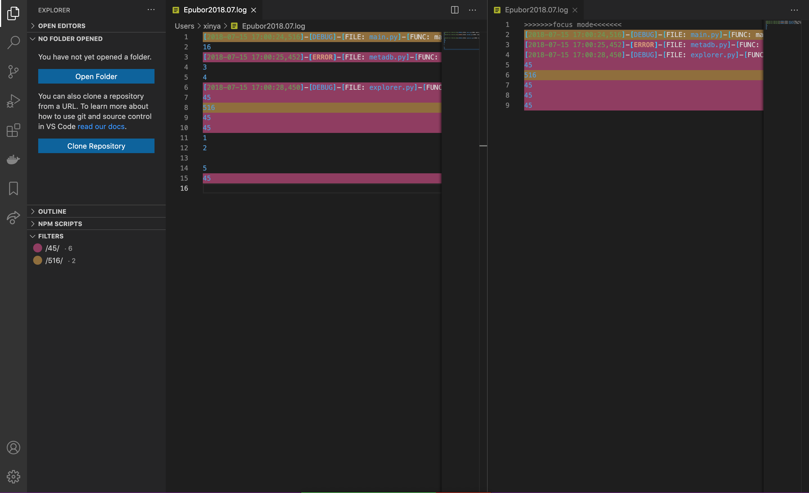
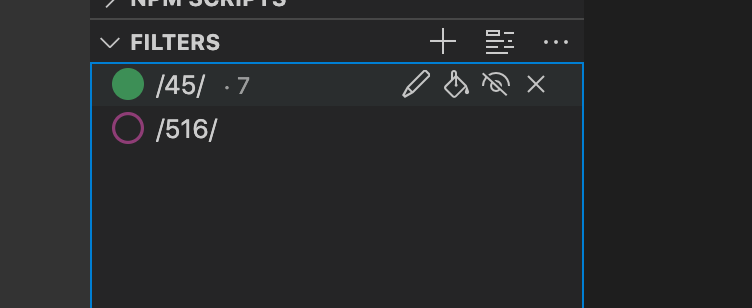

# log-analysis README
Highlight your logs with colorful filters, and manipulate what to display for better log file reading.   
This extension is inspired by [textAnalysisTool.NET](https://textanalysistool.github.io/).

## Features
- Create filters based on user input regular expressions
- Highlight lines that match the filters
- Focus mode: hide lines that don't match your filters
- Import and export filters

## Usage
  
In this picture, there are two filters with default settings located in the "FILTERS" tab. The left editor holds the original document, and all the lines that matches any of the filters have been highlighted. The right editor holds the focus mode of the left document, and notice that the lines which don't match any of the filters' regex are gone. 
The focus mode is implemented as a virtual document (read-only), and the original document is not modified.
### Customization for filters
This extension creates a tab "FILTERS" in the explorer sidebar. This tab holds all the filters created and allows for filter management. 
  
Each line in the tab contains one filter. The filled/unfilled circle represents the color of the filter and whether the highlight is applied to documents. The text represents the regex of the filter. And the number in smaller font, if there is one, represents the number of lines that match the regex in the active editor.   
For each filter, there are four attributes: 
- Color: the color is generated randomly, but if you don't like it, you can generate a new filter. 
- Regex: you can change the regex by click the pencil icon. 
- isHighlighted: If true, the lines that matches the regex will be highlighted with the filter's color. If false, this filter will be ignored for color highlighting. You can toggle this attribute by clicking the paint bucket icon. 
- isShown: Used in focus mode. If true, the lines that matches the regex will be kept; If false, the lines will be removed, unless other filters keep the line. You can toggle this attribute by clicking the eye icon.    
If one line matches multiple regex, because the highlight will overwrite themselves, the final color is not deterministic. However, the line is still counted in all the filters. 
### Focus Mode
You can use ```log-analysis.turnOnFocusMode``` command to activate focus mode for the active editor. The command has a default shortcut: ```ctrl/cmd + h```, or the second icon located on the top of the tab can achieve the same goal. And as the focus mode is just another tab, you can close focus mode as how you close any vscode tab. 
### Import and Export
The filters can be imported and exported as json files. Related commands are ```log-analysis.exportFilters``` and ```log-analysis.importFilters``` and the ... icon on the top of the tab can achieve the same goal. 

## Known Issues
The circle icon for the newly added filter may not show up properly right after the filter gets created. You can toggle ```isHighlighed``` by clicking the paint bucket icon to solve this bug. Sorry! 

## Release Notes
### 1.1.0
- Add supports for editing, multi tabs
- Change to use virtual document for focus mode
